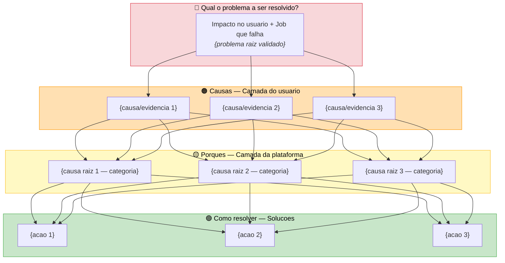

<!-- framework-tag: v2.37.3 framework-file: prds/PRD_TEMPLATE.md -->
# PRD — {ID}: {Titulo}

> Status: `rascunho` | `aprovado` | `em andamento` | `concluido` | `descontinuado`
> Prioridade: `critica` | `alta` | `media` | `baixa`
> Complexidade: `Medio` | `Grande` | `Complexo`
> Criado em: YYYY-MM-DD

## Problema

*O que esta acontecendo? Qual dor ou oportunidade? Quem e afetado? (2-3 frases)*

### Validacao do problema

*O que foi declarado inicialmente e realmente o problema raiz, ou e sintoma/causa de algo maior?*

- **Declaracao original:** *{o que o usuario trouxe primeiro}*
- **Teste de resolucao:** *Se resolvermos isso, o problema maior desaparece? Ou continua existindo?*
- **Nivel identificado:** `problema raiz` | `causa intermediaria` | `sintoma`
- **Problema raiz real:** *{se o original era sintoma/causa, qual e o problema raiz validado}*

## Causas

*O que esta gerando o problema?*

- *Causa 1*
- *Causa 2*
- *Causa 3*

## Evidencias

*Dados concretos que comprovam o problema e sustentam as causas. Metricas, reclamacoes, incidentes.*

- *Dado/metrica 1*
- *Dado/metrica 2*
- *Dado/metrica 3*

## Porques (analise de raiz encadeada)

*Para cada causa, encadear multiplos niveis de "por que?" ate chegar na raiz real. Nao parar no primeiro nivel.*

### Causa 1 — *{titulo}*

1. Por que? → *{resposta nivel 1}*
2. Por que? → *{resposta nivel 2}*
3. Por que? → *{resposta nivel 3}*
4. Por que? → *{resposta nivel 4 — se necessario}*
5. Por que? → *{resposta nivel 5 — se necessario}*

**Causa raiz identificada:** *{resumo da causa raiz desta cadeia}*

### Causa 2 — *{titulo}*

1. Por que? → *{resposta nivel 1}*
2. Por que? → *{resposta nivel 2}*
3. Por que? → *{resposta nivel 3}*

**Causa raiz identificada:** *{resumo}*

### Causa 3 — *{titulo}*

1. Por que? → *{resposta nivel 1}*
2. Por que? → *{resposta nivel 2}*
3. Por que? → *{resposta nivel 3}*

**Causa raiz identificada:** *{resumo}*

## Mapa causal

*Sintetizar as cadeias de porques em relacoes. Identificar onde causas se cruzam e qual tem maior impacto.*

### Nos compartilhados (1 causa → N efeitos)

*Causas raiz que alimentam multiplos problemas/sintomas:*

- *{Causa raiz X} → afeta {efeito 1}, {efeito 2}, {efeito 3}*

### Convergencias (N causas → 1 efeito)

*Efeitos que tem multiplas causas raiz contribuindo:*

- *{Efeito Y} ← causado por {causa 1}, {causa 2}*

### Causa raiz principal

*Qual a causa raiz de maior impacto? Por que essa e a principal?*

- **Causa raiz principal:** *{a que, se resolvida, tem maior efeito cascata}*
- **Justificativa:** *{por que essa e a de maior impacto}*

## Quem e afetado

| Persona | Dor principal | Workaround atual |
|---------|--------------|-------------------|
| *{role}* | *{pain}* | *{current}* |

## Historias de usuario / JTBD

> Opcional para Medio. Recomendado para Grande/Complexo.

- US-001: Como {persona}, quero {acao} para {beneficio}
- US-002: ...

## Como resolver

*Acoes derivadas sistematicamente das causas raiz. Cada acao deve rastrear para uma causa raiz especifica e ser derivada via encadeamento de "como?".*

### Acao 1 — *{titulo}*

**Causa raiz atacada:** *{ref para causa raiz identificada nos Porques}*

**Cadeia de derivacao:**
1. Como resolver a causa raiz? → *{resposta nivel 1}*
2. Como especificamente? → *{resposta nivel 2}*
3. O que concretamente? → *{resposta nivel 3 — acao executavel}*

**Sub-acoes:**
- *Sub-acao 1.1*
- *Sub-acao 1.2*
- *Sub-acao 1.3*

→ Spec: *{link para spec na database ou path do arquivo}*

### Acao 2 — *{titulo}*

**Causa raiz atacada:** *{ref}*

**Cadeia de derivacao:**
1. Como? → *{resposta}*
2. Como especificamente? → *{resposta}*
3. O que concretamente? → *{resposta}*

**Sub-acoes:**
- *Sub-acao 2.1*
- *Sub-acao 2.2*

→ Spec: *{link}*

### Acao 3 — *{titulo}*

**Causa raiz atacada:** *{ref}*

**Cadeia de derivacao:**
1. Como? → *{resposta}*
2. Como especificamente? → *{resposta}*
3. O que concretamente? → *{resposta}*

**Sub-acoes:**
- *Sub-acao 3.1*
- *Sub-acao 3.2*

→ Spec: *{link}*

## Calibracao de escopo

*Validacao de que o PRD esta no nivel correto (epic, nao task).*

| Criterio | Valor | Status |
|----------|-------|--------|
| Total de acoes | *{N}* | *{>=3 → ok, <3 → revisar}* |
| Specs estimadas | *{N}* | *{>=3 → ok, <3 → pode ser task}* |
| Acoes sao executaveis sem detalhar "como implementar"? | *{sim/nao}* | *{sim → ok, nao → muito tecnico}* |
| Resolver todas as acoes elimina o problema raiz? | *{sim/nao}* | *{sim → ok, nao → falta acao}* |

**Nivel validado:** `epic` | `feature` | `task (reformular)`

## Decisoes tomadas

*Registrar o que foi decidido. Quem e responsavel por cada acao.*

| Acao | Responsavel | Prazo | Spec |
|------|-------------|-------|------|
| *Acao 1* | *Nome* | *Data* | *Link* |
| *Acao 2* | *Nome* | *Data* | *Link* |

## Metricas de sucesso

| Metrica | Baseline atual | Meta | Como medir |
|---------|---------------|------|------------|
| *{KPI}* | *{current}* | *{target}* | *{method}* |

## Escopo

### Incluido

- *{item 1}*
- *{item 2}*

### Excluido

- *{item 1}*
- *{item 2}*

## Restricoes e dependencias

> Obrigatorio para Grande/Complexo. Opcional para Medio.

| Tipo | Descricao | Impacto |
|------|-----------|---------|
| *{Tecnica/Negocio/Externa}* | *{description}* | *{what it limits}* |

## Diagrama de padronizacao

*Visualizacao das 4 camadas do PRD: problema → causas (usuario) → porques (plataforma) → solucoes.*

> **Legenda de categorias (camada Porques):** Inexistencia da solucao | Caracteristicas ou regras | Limitacoes tecnicas | UX | Erros ou Bugs | Questoes alheias a Tecnologia | Direcional estrategico | 🔮 Hipotese (necessita validacao)
>
> **Cada acao na camada Como** pode gerar 1 ou N tasks, stories, bugs, etc. A soma de acoes forma o epic.

## Verificacao pos-conclusao

Antes de marcar como `concluido`:

- [ ] Problema raiz validado (nao e sintoma nem causa intermediaria)
- [ ] Todas as causas tem cadeia de porques com >=3 niveis
- [ ] Mapa causal identifica causa raiz principal
- [ ] Todas as acoes rastreiam para uma causa raiz especifica
- [ ] Todas as acoes tem cadeia de derivacao (como?)
- [ ] Calibracao de escopo confirma nivel epic (>=3 acoes/specs)
- [ ] Todas as acoes em "Como resolver" tem spec vinculada
- [ ] Todas as specs vinculadas estao `concluida` ou `descontinuada` com substituta
- [ ] Metricas de sucesso tem baseline e meta definidos
- [ ] Diagrama de padronizacao gerado e validado (4 camadas: problema → causas → porques → solucoes)
- [ ] Agent product-review executado sem gaps criticos
